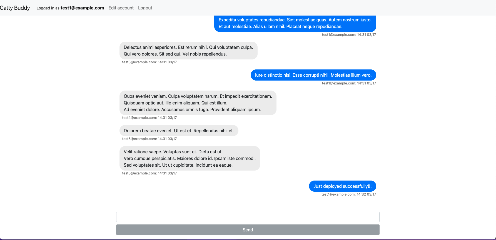

<div id="top"></div>

<!-- PROJECT SHIELDS -->
<!--
*** https://www.markdownguide.org/basic-syntax/#reference-style-links
-->

![app-shield]
![purpose-shield]
![project-title]

<!-- PROJECT IMAGE -->
<div align="center">
  
</div>

<!-- TABLE OF CONTENTS -->
<details>
  <summary>Table of Contents</summary>
  <ol>
    <li>
      <a href="#about-the-project">About The Project</a>
      <ul>
        <li><a href="#build-with">Build With</a></li>
        <li><a href="#gems-used">Gems Used</a></li>
        <li><a href="#entity-relationship-diagram">ER Diagram</a></li>
      </ul>
    </li>
    <li>
      <a href="#getting-started">Getting Started</a>
      <ul>
        <li><a href="#prerequisites">Prerequisites</a></li>
        <li><a href="#installation">Installation</a></li>
      </ul>
    </li>
    <li><a href="#usage">Usage</a></li>
    <li><a href="#acknowledgments">Acknowledgments</a></li>
  </ol>
</details>

<!-- ABOUT THE PROJECT -->

## About The Project

This is a project with Action Cable and Ruby on Rails 6 built for practice purposes.

Action Cable seamlessly integrates [WebSockets][websocket-url] with the rest of your Rails application and allows for real-time features to be written in Ruby. It is a full-stack offering that provides both a client-side JavaScript framework and a server-side Ruby framework.

In this project, I have built a messenger-like application named [Chatty Buddy][project-url] application. For a demonstration, please refer to the [Usage](#usage).
<br>

### Build With

- [Ruby 3.1.4](https://github.com/ruby/ruby)
- [Rails 6.1.4.6](https://github.com/rails/rails)
- [HTML5.0](https://developer.mozilla.org/en-US/docs/Web/HTML)
- [Bootstrap@5.1.3](https://getbootstrap.com/)
- [PostgreSQL 14.9](https://www.postgresql.org/)
  <br>

### Gems Used

- [devise](https://rubygems.org/gems/devise) : Flexible authentication solution for Rails with Warden
- [faker](https://github.com/faker-ruby/faker) : Faker, a port of Data::Faker from Perl, is used to easily generate fake data: names, addresses, phone numbers, etc.
- [pry-byebug](https://rubygems.org/gems/pry-byebug) : Combine 'pry' with 'byebug'. Adds 'step', 'next', 'finish', 'continue' and 'break' commands to control execution.
- [devise-bootstrap-views](https://github.com/hisea/devise-bootstrap-views) : Bootstrap views for Devise with I18n support.

  <br>

### Entity Relationship Diagram


<p align="right"><a href="#top">back to top</a></p>
<br>

<!-- GETTING STARTED -->

## Getting Started

Below are instructions on getting you a copy of the project up and running on your local machine for development purposes.
<br>

### Prerequisites

- bundler

  ```sh
  gem install bundler
  ```

- yarn (it is recommended to install Yarn through the [npm package manager][npm-url])

  ```sh
  npm install --global yarn
  ```

  <br>

### Installation

1. Clone the repo

   ```sh
   git clone https://github.com/Ikko-T/chatty-buddy.git
   ```

2. Change the directory

   ```sh
   cd chatty-buddy
   ```

3. Install the dependencies specified in Gemfile

   ```sh
   bundle install
   ```

4. Create a database

   ```sh
   rails db:create
   ```

<p align="right"><a href="#top">back to top</a></p>
<br>

<!-- USAGE EXAMPLES -->

## Usage

<div align="center">
  
</div>

<p align="right"><a href="#top">back to top</a></p>

<!-- ACKNOWLEDGMENTS -->

## Acknowledgments

- [【Rails6】（送信時のリロード無し！）Action Cable で Slack 風チャットアプリを作成 \- Qiita](https://qiita.com/take18k_tech/items/00cc14c0eff45073ffc7#48-heroku%E3%81%AB%E3%83%87%E3%83%97%E3%83%AD%E3%82%A4%E3%81%99%E3%82%8B%E5%A0%B4%E5%90%88%E3%81%AE%E6%B3%A8%E6%84%8F%E7%82%B9)
- [Rails Tutorial \| Building a Real Messenger App with Rails 6 and Action Cable \- YouTube](https://www.youtube.com/watch?v=s3CmHhDjuWc&t=3334s)

<!--MARKDOWN LINKS & IMAGES -->

[app-shield]: https://img.shields.io/badge/APP-7%20%2F%2020-brightgreen
[purpose-shield]: https://img.shields.io/badge/PURPOSE-Coding%20Challenge%20Websites%2FApps-yellow
[project-title]: https://img.shields.io/badge/PROJECT%20TITLE-Chatty%20Buddy-blue
[npm-url]: https://www.npmjs.com/
[project-url]: https://chatty-buddy-y8brn.ondigitalocean.app/
[websocket-url]: https://en.wikipedia.org/wiki/WebSocket
